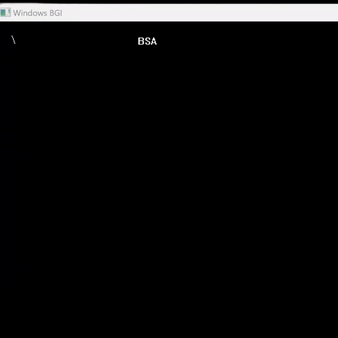

# 📏 BSA Line Drawing Algorithm (Bresenham's)
- The **[Code:📑](../../C/BSA.cpp)**.
- 
- &emsp; &emsp; &emsp; &emsp;fig: for (2,2) to (7,5) 

### ⬆️ Advantages
1. Involves simple integer additions so no need for round off operation.
2. More efficent than DDA.
3. Can be used generate Circle and other curves and is not limited to just lines.
4. Produces Mathematically Accurate results.

### ⬇️ Disadvantages
1. An additional calculation for parameters must be done with each step. 

&nbsp;
## 🤖 **Algorithm**
1. Input the line endpoints and store the left endpiont in (x-initial,y-initial) and right in (x-final,y-final).
    ```cpp
    printf("Enter The Starting Coordinate: ");
    scanf("%d %d", &Beginning.x, &Beginning.y);
    printf("Enter The Ending Cooardinate: ");
    scanf("%d %d", &Ending.x, &Ending.y);
    ```
2. Calculate the values for Differences in x and y. 
    ```cpp
    Difference.x = Ending.x - Beginning.x;
    Difference.y = Ending.y - Beginning.y;
    ```
3. Calculate the Initial Value for Parameter; 
    -  for (m<=1): p = 2*Δy-Δx; for (m>1): p = 2*Δx-Δy;
    1. If Difference on X-coordinates is greater than Y-coordinates:
    ```cpp
    parameter=2*Difference.y-Difference.x; 
    ```
    2. Else If Difference on Y-coordinates is greater than X-coordinates:
    ```cpp
    parameter=2*Difference.x-Difference.y; 
    ```
4. Set x to x-initial and y to y-initial and draw the pixel at coordinate (round(x),round(y))
    ```cpp
    Temp.x=Beginning.x, Temp.y=Beginning.y;
    putpixel(round(Temp.x),round(Temp.y),WHITE);;
    ```
5. Repeat until either X or Y has reached from the beginning coordinates to the ending coordinates according to the values of m:
    - Calculate Parameter according to the value of the initial parameter.
    - Set y to yk or yk+1 according to the parameter where k is the step.
    - Draw the pixel at that coordinate.
    ```cpp
    if (Difference.x>=Difference.y)    {   
        parameter=2*Difference.y-Difference.x; 
        
        while (Temp.x<Ending.x) {
            if(parameter<0) {
                Temp.x++;
                // Temp.y Remains the same
                parameter=parameter+2*Difference.y; // p(k+1) = pk + 2*Δy;
            } else {
                Temp.x++;
                Temp.y++;
                parameter=parameter+(2*Difference.y)-(2*Difference.x); // p(k+1) = pk + 2*Δy - 2*Δx;
            }
            putpixel(Temp.x,Temp.y,WHITE);
        }
    } else if (Difference.y>Difference.x) {
        parameter=2*Difference.x-Difference.y; 
        while (Temp.y<Ending.y) {
            if(parameter<0) {
                Temp.y++;
                // Temp.y Remains the same
                parameter=parameter+2*Difference.x; // p(k+1) = pk + 2*Δx;
            } else {
                Temp.x++;
                Temp.y++;
                parameter=parameter+(2*Difference.x)-(2*Difference.y); // p(k+1) = pk + 2*Δx - 2*Δy;
            }
            putpixel(Temp.x,Temp.y,WHITE);
        }
    }
    ```

&nbsp;
# 📤 Output
- Ran using:
```powershell
g++ BSA.cpp -o BSA -lbgi -lgdi32 -lcomdlg32 -luuid -loleaut32 -lole32 ; ./BSA.exe
```
