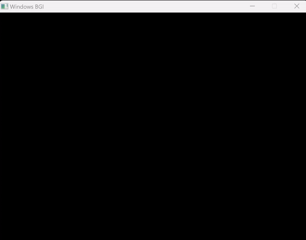

# 📏 DDA Line Drawing Algorithm (Digital Differential Analyzer)
- The **[Code:📑](../../C/DDA.cpp)**.
- 
- &emsp; &emsp; &emsp; &emsp;fig: for (2,2) to (7,5) 

### ⬆️ Advantages
1. Simplest Method as it involves only integer additions.
2. Faster method for calculating pixels than the direct method.
3. Eliminates Multiplication in the equations by making use of raster characteristics.

### ⬇️ Disadvantages
1. Floating Point Arithmetic is still time consuming used internally like when calculating the increments.
2. While Fast, the roud-off Errors make the line jagged.
3. Rounding-off is time consuming still. 

&nbsp;
## 🤖 **Algorithm**
1. Input the line endpoints and store the left endpiont in (x-initial,y-initial) and right in (x-final,y-final).
    ```c
    printf("Enter The Starting Coordinate: ");
    scanf("%d %d", &x_intial, &y_initial);
    printf("Enter The Ending Coordinate: ");
    scanf("%d %d", &x_final, &y_final);
    ```
2. Calculate the values for Differences in x and y. 
    ```c
    difference_x = x_final - x_initial;
    difference_y = y_final - y_initial;
    ```
3. Calculate steps as the absolute value of the largest difference.
    ```c
    if (abs(difference_x) > abs(difference_y)) {
        steps=abs(difference_x);
    } else {
        steps=abs(difference_y);
    }
    ```
4. Calculate the incremental values in x and y.
    ```c
    increment_x=difference_x/steps;
    increment_y=difference_y/steps;
    ```
5. Set x to x-initial and y to y-initial and draw the pixel at coordinate (round(x),round(y))
    ```c
    x=x_initial, y=y_initial;
    putpixel(round(x),round(y),WHITE);
    ```
6. Repeat until steps is reached to its end.
    - Set x to x + x-increment.
    - Set y to y + y-increment.
    - Draw the pixel at coordinate (round(x),round(y));
    ```c
    for (int i=0; i<steps;i++) {
        delay(5);
        y+=increment_y;
        x+=increment_x;
        printf("\n Plot Values: x: %f y: %f", round(x), round(y));
        putpixel(round(x),round(y),WHITE);
    }
    ```

&nbsp;
# 📤 Output
- Ran using:
```powershell
g++ DDA.cpp -o DDA -lbgi -lgdi32 -lcomdlg32 -luuid -loleaut32 -lole32
```
