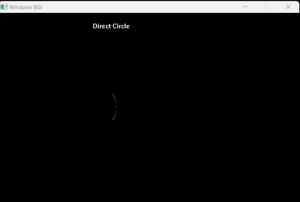

# ⭕ Direct Circle Drawing Algorithm
- The **[Code:📑](../../C/DirectCircle.cpp)**.

### ⬆️ Advantages
1. Simple. 

### ⬇️ Disadvantages
1. Due to floating point calculation actual pixel position may be away from the circular path.
2. Due to Square Root Calculation, algorithm requires more computational time so becomes slower. 

&nbsp;
## 🤖 **Algorithm**
1. Input the line endpoints and store the Centre and the Radius of the Circle:
    ```cpp
    printf("Enter The Center Coordinate: ");
    scanf("%d %d", &Centre.x, &Centre.y);
    printf("Enter The Radius of the circle: ");
    scanf("%f", &Radius);
    ```
2. Set x to Radius distance away from the X-Coordinate of the centre of the Circle.
    ```cpp
    Temp.x=Centre.x+Radius;
    ```
3. Repeat until x reaches Radius Distance opposite way from the X-coordinate of the centre of the circle.
    - Calculate the y coordinate according to the formula: y = yc ± √(r^2-(x-xc)^2) individually.
    - Draw the pixel at that coordinate.
    ```cpp
    for (; Temp.x>=Centre.x-Radius;Temp.x--) {
        delay(10);
        Temp.y=Centre.y+sqrt(pow(Radius,2)-pow(Temp.x-Centre.x,2));
        putpixel(round(Temp.x),round(Temp.y),WHITE);
        Temp.y=Centre.y-sqrt(pow(Radius,2)-pow(Temp.x-Centre.x,2));
        putpixel(round(Temp.x),round(Temp.y),WHITE);
    }
    ```

&nbsp;
# 📤 Output
- Ran using:
```powershell
g++ DirectCircle.cpp -o DirectCirlce -lbgi -lgdi32 -lcomdlg32 -luuid -loleaut32 -lole32 ; ./DirectCircle.exe
```
