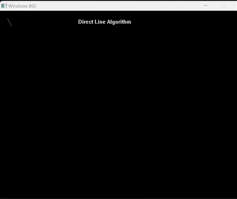

# 📏 Direct Line Drawing Algorithm
- The **[Code:📑](../../C/DirectLine.cpp)**.
- 
- &emsp; &emsp; &emsp; &emsp;fig: for (2,2) to (7,5) 

### ⬇️ Disadvantages
1. Uses Multiplication and is slower.
2. Slower than DDA.
3. Line may not be as smooth.

&nbsp;
## 🤖 **Algorithm**
1. Input the line endpoints and store the left endpiont in (x-initial,y-initial) and right in (x-final,y-final).
    ```cpp
    printf("Enter The Starting Coordinate: ");
    scanf("%d %d", &Beginning.x, &Beginning.y);
    printf("Enter The Ending Cooardinate: ");
    scanf("%d %d", &Ending.x, &Ending.y);
    ```
2. Calculate the values for Differences in x and y. 
    ```cpp
    Difference.x = Ending.x - Beginning.x;
    Difference.y = Ending.y - Beginning.y;
    ```
3. Calculate the Slope and Constant.
    ```cpp
    float Slope = Difference.y/Difference.x;
    float Constant = Beginning.y-Slope*Beginning.x;
    ```
4. Set x to x-initial.
    ```cpp
    Temp.x=Beginning.x;
    ```
5. Repeat until the Beginning x coordinate has reached its ending coordinates.
    - Solve for y=mx+b; where m = Slope and b = Constant.
    - Draw the pixel at coordinate (round(x),round(y));
    ```cpp
    for (; Temp.x<=Ending.x;Temp.x=Temp.x+1) {
        delay(5);
        Temp.y=(Slope*Temp.x)+Constant;
        putpixel(round(Temp.x),round(Temp.y),WHITE);
    }
    ```

&nbsp;
# 📤 Output
- Ran using:
```powershell
g++ DirectLine.cpp -o DirectLine -lbgi -lgdi32 -lcomdlg32 -luuid -loleaut32 -lole32 ; ./DirectLine.exe
```
