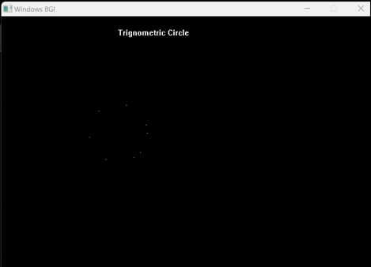

# ⭕ Trignometric Circle Drawing Algorithm
- The **[Code:📑](../../C/TrignometricCircle.cpp)**.

### ⬆️ Advantages
1. Simple. 

### ⬇️ Disadvantages
1. Due to floating point calculation actual pixel position may be away from the circular path.

&nbsp;
## 🤖 **Algorithm**
1. Input the Centre and the Radius of the Circle:
    ```cpp
    printf("Enter The Center Coordinate: ");
    scanf("%d %d", &Centre.x, &Centre.y);
    printf("Enter The Radius of the circle: ");
    scanf("%f", &Radius);
    ```
2. Repeat until Theta (The angle) reaches $360\degree$ starting from $\theta=0\degree$.
    - Calculate the c and y coordinates as: $x = x_c + r \cos(\theta)$ and $y = y_c + r \sin(\theta)$;
    - Draw the pixel at that coordinate.
    ```cpp
    for (int Theta=0;Theta<360;Theta++) {
        delay(10);
        Temp.x=Centre.x+Radius*cos(Theta);
        Temp.y=Centre.y+Radius*sin(Theta);
        printf("\n Plot Values: x: %f y: %f", round(Temp.x), round(Temp.y));
        putpixel(round(Temp.x),round(Temp.y),WHITE);
    }
    ```

&nbsp;
# 📤 Output
- Ran using:
```powershell
g++ TrignometricCircle.cpp -o TrignometricCircle -lbgi -lgdi32 -lcomdlg32 -luuid -loleaut32 -lole32 ; ./TrignometricCircle.exe
```
