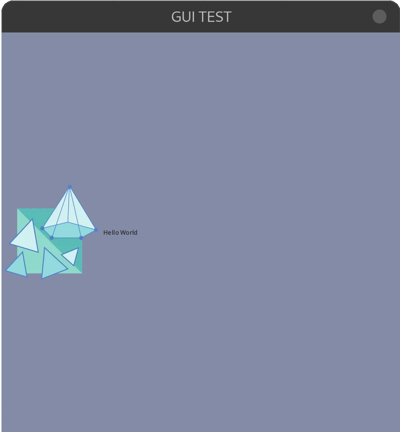

# ☕️ Java Implementation of Graphics
- creating using JFrames
- was easier and more compatible to setup than the c project

## ⚙️ Setting up 
- setting up basic things
    ### list of imports
    - List of all the imports:
    ```java
    import javax.swing.ImageIcon; //for image icon
    import javax.swing.JFrame;
    ```

    ### Setting up a Visible screen
    - It is done with JFrame but visibility needs to be toggled.
    - Size of the window needs to be set or it becomes too small to see.
    - $\color{#D29922}\textsf{\Large\&#x26A0;\kern{0.2cm}\normalsize Warning}$:  The close button only hides the window and doesn't close it. reference the [Problem](#close-button-hiding-window)
    - $\color{#D29922}\textsf{\Large\&#x26A0;\kern{0.2cm}\normalsize Warning}$: The Window is resizable. reference the [Problem](#make-window-unresizable)

    ```java
    public class test {
        public static void main(String[] args){
            JFrame frame= new JFrame(); //create a frame
            frame.setSize(800,800);
            frame.setVisible(true);//making it visible
        }
    }
    ```

    ### Giving Title to Window
    - Done with setTitle method
    ```cpp
    frame.setTitle("GUI TEST");
    ```

    ### Giving Icon to the window [🔧Needs Work]
    - Done with creating an image Icon:
    - Need to [import](#imports-list-of-imports)
    - <span style="color:red"> **PROBLEM:**</span> Did not work on Fedora Linux. reference the [Problem](#imageicon-not-working-linux)
    ```java
    ImageIcon image = new ImageIcon("../NOTES/Resources/icon.png");
    ```
    - Then setting it to the frame:
    ```java
    frame.setIconImage(image.getImage());
    ```

    ### Setting Background of the Window
    - needs to be chained
    ```cpp
    frame.getContentPane().setBackground(Color.BLACK);
    ```
    - for custom colors
    ```cpp
    frame.getContentPane().setBackground(new Color(131,139,167));
    ```

## 🏷️ Labels
- To insert Label to Frame
    ### list of imports
    - List of required imports:
    ```java
    import javax.swing.JLabel;
    ```

    ### Creating a Label Object
    - Java Label Can be created with 
    ```java
    JLabel label = new JLabel();
    ```

    ### Setting Text to a Label Object
    - Text can be set to label with either
    ```java
    label.setText("Hello World");
    ```
    - after object creation or at the time of object creation
    ```java
    JLabel label = new JLabel("Hello World");
    ```
    - $\color{#58A6FF}\textsf{\Large\&#x24D8;\kern{0.2cm}\normalsize Note}$: This will put the left to the y centered x left most position of the screen by default 

    ### Adding Image Icon to a Label Object 
    - To add the image to the label along, first [create an Image Icon](#giving-icon-to-the-window-🔧needs-work).  
    - Then use the setIcon on the Label for it.
    ```java
    label.setIcon(image);
    ```
    | Output | |
    |----------------|----------------|

&nbsp;

## ❗️ Problems
- List of all the problems that occured.
    ## Solved
    - List of solved problems
        ### close button hiding window
        - to fix this
        ```cpp
        frame.setDefaultCloseOperation(JFrame.EXIT_ON_CLOSE);
        ```

        ### Make window Unresizable
        ```cpp
        frame.setResizable(false);
        ```
    
    ## To be solved
    - List of problems to be solved
        ### ImageIcon not working linux
        - //todo